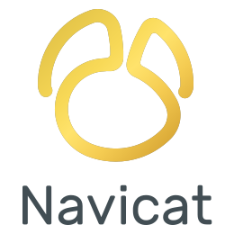

### Hi fellows 👋
- 🔭 I’m currently working on [Monitaz](https://monitaz.com/)
- 📫 How to reach me:

[](https://www.facebook.com/SuBiBi155)
[](https://teams.live.com/l/invite/FEATVANtpU_KFHnfA?v=g1)
[](https://www.linkedin.com/in/ti%E1%BA%BFn-%C4%91%E1%BA%A1t-l%C3%AA-ba267a232/)
[](https://t.me/subibi1505)
[](mailto:tiendat15599.dev@gmail.com)
[](mailto:tiendat15599@yahoo.com.vn)

[comment]: <> (### Spotify Playing 🎧)

[comment]: <> ([]&#40;https://open.spotify.com/user/21wi7t5t4zyugx5mgetrdo7xa&#41;)
### Last.fm Playing 🎧
[](https://www.last.fm/user/tiendat15599)

---

### Tools:



<br>

### Libraries and Frameworks:


<br>

### Databases:


<br>
<br>

---

[comment]: <> (![Lê Tiến Đạt's GitHub stats]&#40;https://github-readme-stats.vercel.app/api?username=tiendat15599&show_icons=true&count_private=true&theme=tokyonight&#41;)
### Development Stats


<!--START_SECTION:waka-->


**🐱 My GitHub Data** 

> 📦 276.6 kB Used in GitHub's Storage 
 > 
> 🏆 15 Contributions in the Year 2026
 > 
> 🚫 Not Opted to Hire
 > 
> 📜 28 Public Repositories 
 > 
> 🔑 23 Private Repositories 
 > 
**I'm an Early 🐤** 

```text
🌞 Morning                706 commits         ████████░░░░░░░░░░░░░░░░░   33.88 % 
🌆 Daytime                604 commits         ███████░░░░░░░░░░░░░░░░░░   28.98 % 
🌃 Evening                554 commits         ███████░░░░░░░░░░░░░░░░░░   26.58 % 
🌙 Night                  220 commits         ███░░░░░░░░░░░░░░░░░░░░░░   10.56 % 
```
📅 **I'm Most Productive on Thursday** 

```text
Monday                   235 commits         ███░░░░░░░░░░░░░░░░░░░░░░   11.28 % 
Tuesday                  318 commits         ████░░░░░░░░░░░░░░░░░░░░░   15.26 % 
Wednesday                362 commits         ████░░░░░░░░░░░░░░░░░░░░░   17.37 % 
Thursday                 411 commits         █████░░░░░░░░░░░░░░░░░░░░   19.72 % 
Friday                   369 commits         ████░░░░░░░░░░░░░░░░░░░░░   17.71 % 
Saturday                 105 commits         █░░░░░░░░░░░░░░░░░░░░░░░░   05.04 % 
Sunday                   284 commits         ███░░░░░░░░░░░░░░░░░░░░░░   13.63 % 
```


📊 **This Week I Spent My Time On** 

```text
💬 Programming Languages: 
Other                    5 hrs 7 mins        ██████████░░░░░░░░░░░░░░░   40.63 % 
PHP                      3 hrs 10 mins       ██████░░░░░░░░░░░░░░░░░░░   25.21 % 
Python                   2 hrs 32 mins       █████░░░░░░░░░░░░░░░░░░░░   20.15 % 
Markdown                 53 mins             ██░░░░░░░░░░░░░░░░░░░░░░░   07.09 % 
JavaScript               26 mins             █░░░░░░░░░░░░░░░░░░░░░░░░   03.56 % 

🔥 Editors: 
PhpStorm                 5 hrs 3 mins        ██████████░░░░░░░░░░░░░░░   40.08 % 
PyCharm                  2 hrs 36 mins       █████░░░░░░░░░░░░░░░░░░░░   20.61 % 
NavicatPremium           1 hr 17 mins        ███░░░░░░░░░░░░░░░░░░░░░░   10.19 % 
Claude Code              1 hr 5 mins         ██░░░░░░░░░░░░░░░░░░░░░░░   08.70 % 
FileZillaFTPClient       51 mins             ██░░░░░░░░░░░░░░░░░░░░░░░   06.75 % 

💻 Operating System: 
Windows                  8 hrs 40 mins       █████████████████░░░░░░░░   68.78 % 
Linux                    3 hrs 56 mins       ████████░░░░░░░░░░░░░░░░░   31.22 % 
```

🤖 **AI Coding This Week** 

```text
No AI Coding Activity Tracked This Week
```

**I Mostly Code in PHP** 

```text
PHP                      20 repos            ████████████████░░░░░░░░░   64.52 % 
JavaScript               7 repos             ██████░░░░░░░░░░░░░░░░░░░   22.58 % 
HTML                     2 repos             ██░░░░░░░░░░░░░░░░░░░░░░░   06.45 % 
Batchfile                1 repo              █░░░░░░░░░░░░░░░░░░░░░░░░   03.23 % 
Python                   1 repo              █░░░░░░░░░░░░░░░░░░░░░░░░   03.23 % 
```


 Last Updated on 13/09/2026 03:55:18 UTC
<!--END_SECTION:waka-->
