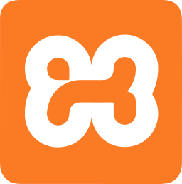
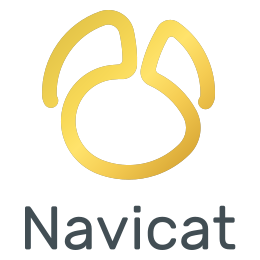

### Hi fellows 👋
- 🔭 I’m currently working on [Monitaz](https://monitaz.com/)
- 📫 How to reach me:

[](https://www.facebook.com/SuBiBi155)
[](https://teams.live.com/l/invite/FEATVANtpU_KFHnfA?v=g1)
[](https://www.linkedin.com/in/ti%E1%BA%BFn-%C4%91%E1%BA%A1t-l%C3%AA-ba267a232/)
[](https://t.me/subibi1505)
[](mailto:tiendat15599.dev@gmail.com)
[](mailto:tiendat15599@yahoo.com.vn)

[comment]: <> (### Spotify Playing 🎧)

[comment]: <> ([]&#40;https://open.spotify.com/user/21wi7t5t4zyugx5mgetrdo7xa&#41;)
### Last.fm Playing 🎧
[](https://www.last.fm/user/tiendat15599)

---

### Tools:






<br>

### Libraries and Frameworks:


<br>

### Databases:


<br>
<br>

---

[comment]: <> (![Lê Tiến Đạt's GitHub stats]&#40;https://github-readme-stats.vercel.app/api?username=tiendat15599&show_icons=true&count_private=true&theme=tokyonight&#41;)
### Development Stats


<!--START_SECTION:waka-->


**🐱 My GitHub Data** 

> 📦 276.7 kB Used in GitHub's Storage 
 > 
> 🏆 15 Contributions in the Year 2026
 > 
> 🚫 Not Opted to Hire
 > 
> 📜 28 Public Repositories 
 > 
> 🔑 23 Private Repositories 
 > 
**I'm an Early 🐤** 

```text
🌞 Morning                708 commits         ████████░░░░░░░░░░░░░░░░░   33.99 % 
🌆 Daytime                601 commits         ███████░░░░░░░░░░░░░░░░░░   28.85 % 
🌃 Evening                554 commits         ███████░░░░░░░░░░░░░░░░░░   26.60 % 
🌙 Night                  220 commits         ███░░░░░░░░░░░░░░░░░░░░░░   10.56 % 
```
📅 **I'm Most Productive on Thursday** 

```text
Monday                   235 commits         ███░░░░░░░░░░░░░░░░░░░░░░   11.28 % 
Tuesday                  320 commits         ████░░░░░░░░░░░░░░░░░░░░░   15.36 % 
Wednesday                362 commits         ████░░░░░░░░░░░░░░░░░░░░░   17.38 % 
Thursday                 411 commits         █████░░░░░░░░░░░░░░░░░░░░   19.73 % 
Friday                   369 commits         ████░░░░░░░░░░░░░░░░░░░░░   17.71 % 
Saturday                 102 commits         █░░░░░░░░░░░░░░░░░░░░░░░░   04.90 % 
Sunday                   284 commits         ███░░░░░░░░░░░░░░░░░░░░░░   13.63 % 
```


📊 **This Week I Spent My Time On** 

```text
💬 Programming Languages: 
Other                    17 hrs 13 mins      ████████████░░░░░░░░░░░░░   49.41 % 
Python                   10 hrs 10 mins      ███████░░░░░░░░░░░░░░░░░░   29.17 % 
PHP                      2 hrs 45 mins       ██░░░░░░░░░░░░░░░░░░░░░░░   07.89 % 
Markdown                 1 hr 38 mins        █░░░░░░░░░░░░░░░░░░░░░░░░   04.72 % 
HTML                     44 mins             █░░░░░░░░░░░░░░░░░░░░░░░░   02.13 % 

🔥 Editors: 
Claude Code              18 hrs 39 mins      █████████████░░░░░░░░░░░░   53.48 % 
NavicatPremium           3 hrs 44 mins       ███░░░░░░░░░░░░░░░░░░░░░░   10.71 % 
SSH,Telnet,Rlogin,andSUPD3 hrs 34 mins       ███░░░░░░░░░░░░░░░░░░░░░░   10.26 % 
FileZillaFTPClient       3 hrs 19 mins       ██░░░░░░░░░░░░░░░░░░░░░░░   09.52 % 
PyCharm                  3 hrs 18 mins       ██░░░░░░░░░░░░░░░░░░░░░░░   09.48 % 

💻 Operating System: 
Windows                  34 hrs 52 mins      █████████████████████████   100.00 % 
```

🤖 **AI Coding This Week** 

```text
⏱ AI Coding Time: 19 hrs 12 mins (55.09%)

✍️ 25,951 lines written by AI, 2,762 lines written by hand (90.38% AI-written)

🔤 11,550,946 Input Tokens, 2,403,728 Output Tokens

💵 $365.70 Estimated AI Cost This Week

🧠 28 AI Sessions, 198 AI Prompts

Opus                     26,424 lines        █████████████████████████   100.00 % 

🔎 AI Coding Insights:
🤖 AI-Driven — 90.38% of written lines came from AI
📄 Detailed Prompter — average 1,277 characters per prompt
🔁 Iterative Prompter — average 7 prompts per session
🚀 High AI Trust — 9.66% of changed lines were hand-edited
```

**I Mostly Code in PHP** 

```text
PHP                      20 repos            ████████████████░░░░░░░░░   64.52 % 
JavaScript               7 repos             ██████░░░░░░░░░░░░░░░░░░░   22.58 % 
HTML                     2 repos             ██░░░░░░░░░░░░░░░░░░░░░░░   06.45 % 
Batchfile                1 repo              █░░░░░░░░░░░░░░░░░░░░░░░░   03.23 % 
Python                   1 repo              █░░░░░░░░░░░░░░░░░░░░░░░░   03.23 % 
```


 Last Updated on 29/09/2026 19:53:06 UTC
<!--END_SECTION:waka-->
